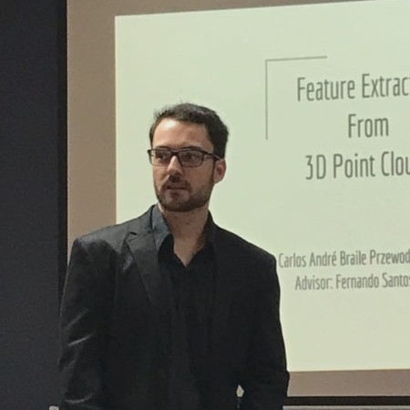

---
# Feel free to add content and custom Front Matter to this file.
# To modify the layout, see https://jekyllrb.com/docs/themes/#overriding-theme-defaults

layout: home
---

I am a Professor at UNICEP, PhD Candidate at Universidade de São Paulo (USP) and a research assistant at the Laboratory of Mobile Robotics (LRM).

Currently, my research interests involve localization of autonomous vehicles, SLAM and general robotics perception.

Check out my latest publications [here](/publications)!